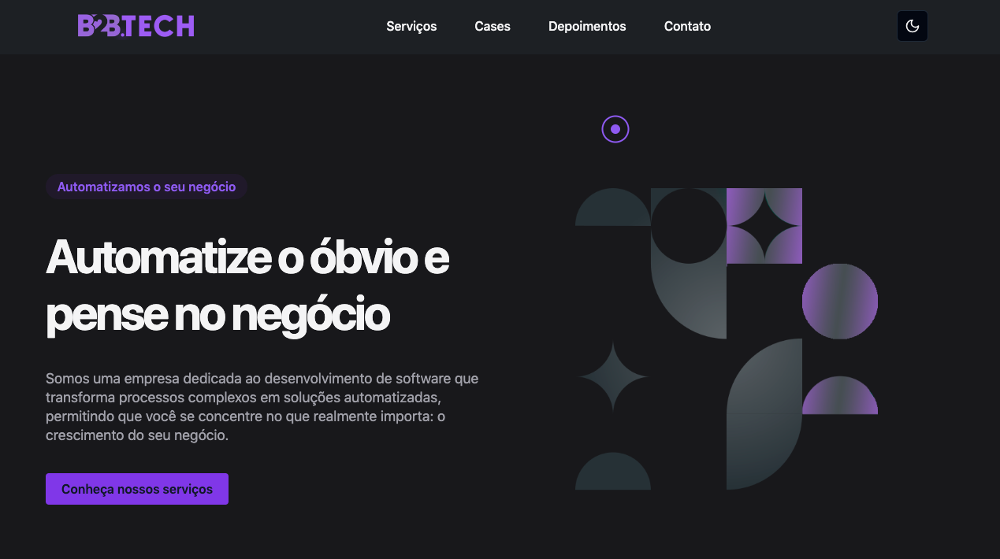

# 🚀 B2B Tech



## 📑 Índice

- [Sobre](#-sobre)
- [Tecnologias Usadas](#-tecnologias-usadas)
- [Como Baixar o Projeto](#-como-baixar-o-projeto)

---

## 💡 Sobre

Bem-vindo ao **B2B Tech**! Este projeto exibe uma landing page moderna e elegante para uma startup de tecnologia B2B. Criado com as tecnologias mais recentes, o objetivo deste app é oferecer uma experiência de alta qualidade para os usuários no setor de tecnologia.

---

## ⚙️ Tecnologias Usadas

Este projeto foi desenvolvido utilizando as tecnologias mais avançadas para garantir escalabilidade, desempenho e uma excelente experiência de usuário. As principais ferramentas e bibliotecas utilizadas são:

- **[ReactJS](https://legacy.reactjs.org)**: Biblioteca poderosa para construção de interfaces de usuário.
- **[React Router DOM](https://reactrouter.com/en/main)**: Roteamento declarativo para aplicações React.
- **[React Helmet Async](https://github.com/staylor/react-helmet-async)**: Gerenciamento do cabeçalho do documento (título, meta tags) para SEO aprimorado.
- **[React Animated Cursor](https://www.npmjs.com/package/react-animated-cursor)**: Aumente a interatividade com um cursor animado estiloso.
- **[TypeScript](https://www.typescriptlang.org)**: Superconjunto do JavaScript que adiciona segurança de tipos para um desenvolvimento mais robusto.
- **[Tailwind CSS](https://tailwindcss.com)**: Framework CSS utilitário para criar designs de UI rápidos e personalizáveis.
- **[Shadcn UI](https://ui.shadcn.com/)**: Componentes de UI elegantes e personalizáveis.
- **[Swiper](https://swiperjs.com/)**: O slider mais moderno e interativo.
- **[Lucide Icons](https://lucide.dev)**: Conjunto de ícones open-source de alta qualidade.
- **[Prettier](https://github.com/tailwindlabs/prettier-plugin-tailwindcss)**: Formatador de código para estilo consistente.
- **[ESLint](https://eslint.org/)**: Ferramenta de linting para identificar e corrigir problemas no código JavaScript.
- **[Vite](https://vitejs.dev)**: Ferramenta de build rápida e eficiente para projetos web modernos.

---

## 🛠 Como Baixar o Projeto

Para rodar o projeto localmente, siga os passos abaixo:

```bash
# Clone o repositório
$ git clone https://github.com/vanessabrazuna/b2btech

# Acesse o diretório do projeto
$ cd siteb2btech

# Instale as dependências do projeto
$ npm install

# Inicie o servidor de desenvolvimento
$ npm run dev
```

Após o servidor estar rodando, você pode acessar `http://localhost:5173` para ver o projeto em funcionamento!

---

Feito com ❤️ por [Vanessa Brazuna](https://github.com/VanessaBrazuna)
